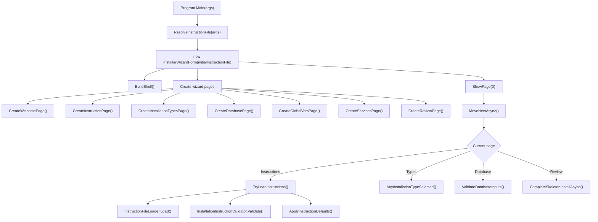
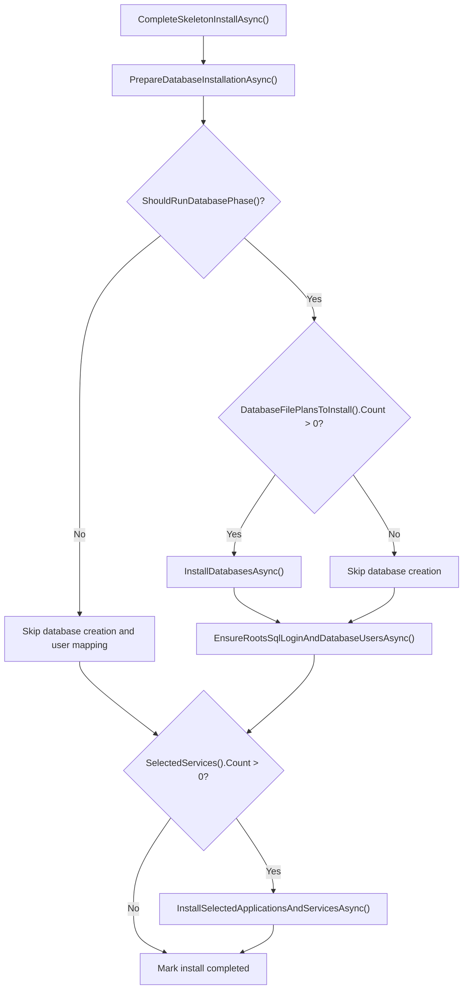
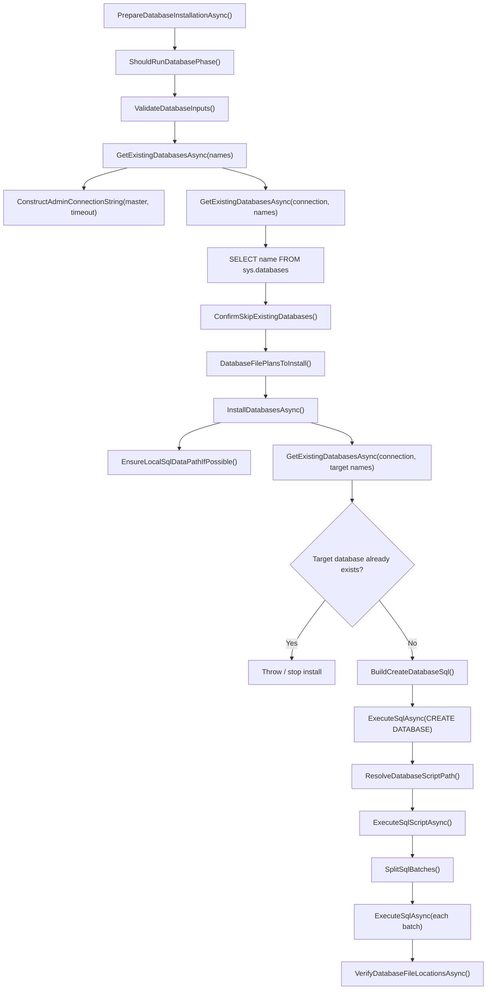
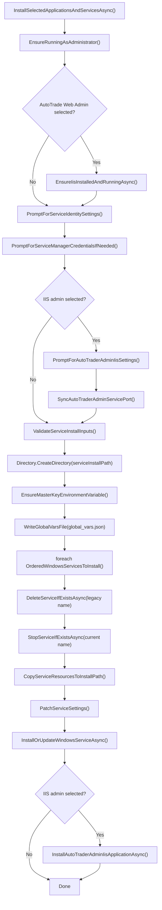
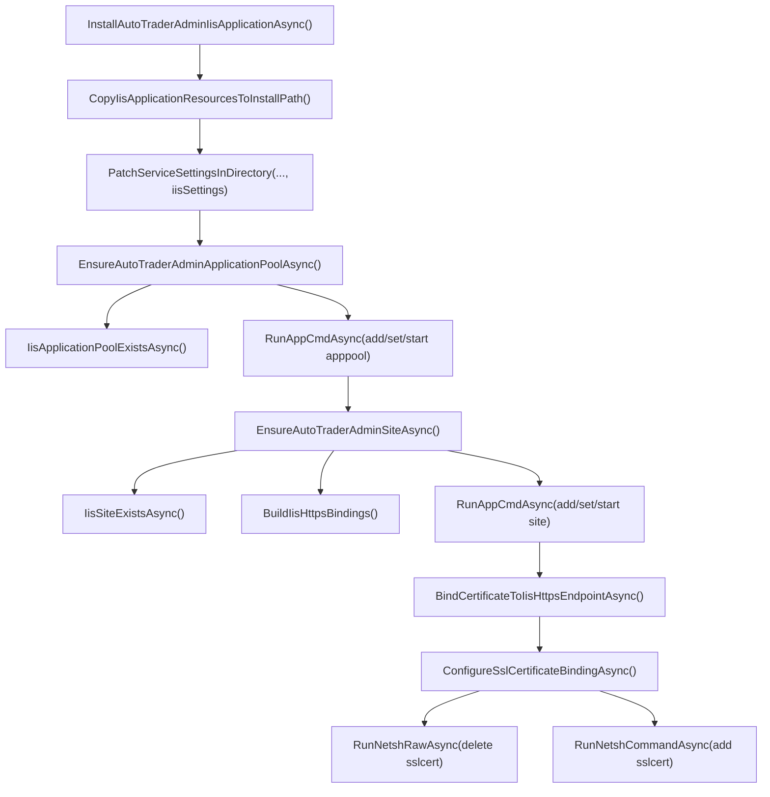

# FIGInstaller Flow Reference

This is a quick map for changing installer behavior without re-reading the whole `InstallerWizardForm`.

## Main Entry Flow

## Install Button Execution Flow

`CompleteSkeletonInstallAsync()` is the real install orchestrator, despite the older "Skeleton" name.

## Database Flow

## Services And IIS Flow

## IIS Admin App Flow

## What To Edit

| Goal | Primary function(s) |
| --- | --- |
| Add/remove wizard pages | `InstallerWizardForm(...)`, `Create*Page()`, `IsPageVisible()` |
| Change instruction JSON loading | `TryLoadInstructions()`, `InstructionFileLoader.Load()` |
| Change instruction validation rules | `InstallationInstructionValidator.Validate*()` |
| Change component-to-service selection | `ServiceDescriptors`, `SelectedInstallerComponents()`, `SelectedServices()`, `SelectedWindowsServices()`, `OrderedServicesToInstall()` |
| Change whether database phase runs | `ShouldRunDatabasePhase()`, `ShouldInstallBrokerDatabase()`, `HasBrokerDatabaseInstruction()` |
| Check if databases already exist | `PrepareDatabaseInstallationAsync()`, `GetExistingDatabasesAsync(...)` |
| Change existing-database behavior | `ConfirmSkipExistingDatabases()`, `_databaseNamesToSkip` handling |
| Create databases | `InstallDatabasesAsync()`, `BuildCreateDatabaseSql()` |
| Change SQL script lookup | `ResolveDatabaseScriptPath()`, `ResolveResourcePath()` |
| Change SQL batch parsing | `SplitSqlBatches()`, `GetGoBatchRepeatCount()` |
| Verify SQL file placement | `VerifyDatabaseFileLocationsAsync()`, `SamePath()` |
| Create roots SQL login/users | `EnsureRootsSqlLoginAndDatabaseUsersAsync()` |
| Build service connection strings | `BuildRootsConnectionString()`, `ConstructAdminConnectionString()` |
| Write `global_vars.json` | `WriteGlobalVarsFile()`, `ProtectConfigurationValue()` |
| Set machine master key | `EnsureMasterKeyEnvironmentVariable()` |
| Copy service binaries/resources | `CopyServiceResourcesToInstallPath()`, `CopyDirectory()`, `ResolveServiceResourceDirectory()` |
| Patch service settings JSON | `PatchServiceSettings()`, `PatchServiceSettingsInDirectory()` |
| Preserve `{{...}}` template values | `SetJsonStringUnlessTemplate()`, `SetJsonIntUnlessTemplate()`, `SetJsonArrayUnlessTemplate()`, `RemoveJsonPropertyUnlessTemplate()`, `IsTemplateValue()` |
| Create/update Windows services | `InstallOrUpdateWindowsServiceAsync()` |
| Check if a Windows service exists | `ServiceExistsAsync()` |
| Stop/delete Windows services | `StopServiceIfExistsAsync()`, `DeleteServiceIfExistsAsync()` |
| Run `sc.exe` | `RunScCommandAsync()`, `RunScCommandRawAsync()` |
| Install IIS admin app | `InstallAutoTraderAdminIisApplicationAsync()` |
| Check IIS prerequisites | `EnsureIisInstalledAndRunningAsync()`, `ResolveAppCmdPath()` |
| Create/update IIS app pool | `EnsureAutoTraderAdminApplicationPoolAsync()`, `IisApplicationPoolExistsAsync()` |
| Create/update IIS site | `EnsureAutoTraderAdminSiteAsync()`, `IisSiteExistsAsync()`, `BuildIisHttpsBindings()` |
| Bind IIS HTTPS certificate | `BindCertificateToIisHttpsEndpointAsync()`, `ConfigureSslCertificateBindingAsync()` |
| Run IIS / netsh commands | `RunAppCmdAsync()`, `RunAppCmdRawAsync()`, `RunNetshCommandAsync()`, `RunNetshRawAsync()`, `RunProcessRawAsync()` |

## Key Data Decisions

- `ServiceDescriptors` maps installer package keys to resource folders, settings files, executable names, component membership, install order, and install kind.
- `SelectedServices(...)` returns installer package keys. The installed Windows service name comes from `ServiceInstallSettings.SettingsServiceName`, loaded from `Global:Vars:Service_Name`.
- `SelectedServices(includeServiceManager: true)` adds the descriptor marked with `WritesManagedServices` when any Windows service descriptor is selected.
- AutoTrade Web Admin is treated as an IIS app by `IsIisApplicationInstallable()`, not as a Windows service.
- `PreviousInstallationDatabaseNames` checks for `FIGAutoTrader`, `FIGUser`, and `FIGAlert` before AutoTrade database installation.
- `FIGBroker` is installed only when the Broker component is selected and a `FIGBroker` database instruction exists.
- Existing databases confirmed by the user are added to `_databaseNamesToSkip`, so the installer skips them instead of recreating them.
