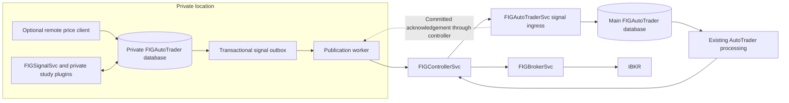

# Remote signal publication

`FIGSignalSvc` supports two startup modes. The default `SharedDatabase` retains direct database operation and requires no publication schema. `RemotePublisher` uses a private database and sends signal snapshots through the existing controller to an explicitly identified `FIGAutoTraderSvc`. That service commits them to its main database and the existing `SIGNAL` event trigger wakes trading processing.



## Delivery contract

- The private database owns the published signal. Every actual insert or business-field update captures a new immutable revision in the same SQL transaction. Changes made while the service is stopped are captured as well, once publication has been initialized.
- The worker wakes immediately after signal generation commits, also listens for `SIGNAL` events, and retries pending rows every 5 seconds by default. A complete verification scan runs at startup and every 60 seconds after the preceding scan completes. These are scheduling intervals, not network latency guarantees; outages and large backlogs extend completion time.
- Every signal record is retained and its **latest state** is delivered. Superseded revisions remain in the private outbox for audit, but are not replayed as trading instructions. A START that became STOP while offline is delivered directly as STOP.
- Delivery is at least once. The receiver serializes requests, maps `(ProducerId, Tag)` to its own database identity, rejects stale or conflicting revisions, and acknowledges only after committing both the signal and receipt. Retries do not duplicate signals or repeatedly trigger unchanged trading events.
- A source acknowledgement updates `SyncedVersion` only if the current revision still matches. An update arriving during delivery remains pending. Receipt matching covers producer, message, tag, revision and content hash.
- Full verification includes previously synchronized and STOP records. It repairs differing or missing main `Signal` rows. Unchanged rows do not generate SQL signal updates. A failed verification marks the source record unsynchronized and records the error.
- STOP cannot reopen; its stop time and identity are final. Subsequent price corrections and `LastUpdated` changes are captured and delivered. Tag, strategy, side and start time are immutable after initial capture.

This provides eventual synchronization of committed source records while the durable databases are intact and connectivity, credentials and metadata recover. It cannot guarantee instantaneous delivery during an outage, recover destroyed source data without backups, or guarantee exactly-once broker execution. Trading eligibility and order reconciliation remain the responsibility of the existing trading services.

## Deployment

Price ingestion is handled by the dedicated FIGPriceDataSvc, which retrieves prices through the controller-routed historical API and writes to the same local database used by FIGSignalSvc. FIGSignalSvc monitors local price changes to build studies and signals; it no longer hosts a price synchronization worker. See [FIGPriceDataSvc configuration and scheduling](../../FIGPriceDataSvc/README.md).

1. Stop the services involved in the cutover and back up both databases. Use a private database containing the assigned strategies and signals. Its schema must also include existing dependencies such as `Interval`, `Event`, settings and the stored procedures/triggers used by price and study processing; the eight principal data tables alone are insufficient. Do not copy broker credentials into the private installation.
2. Run `FIGCommon/DataSchema/signal_publication_receiver.sql` against the **main** execution database. Run `FIGCommon/DataSchema/signal_publication_source.sql` against the **private** database. Both scripts are repeatable and operate on the database selected by the SQL connection; neither selects a database or runs automatically. Run with SQL errors treated as fatal. The private migration requires unique Signal tags and SQL Server JSON support. Resolve any duplicate legacy tags before applying it. Both scripts support the baseline `FIGCommon/DataSchema/FIGAutoTrader_Schema.sql`: no cancellation column is added or required, and the baseline signal procedures and their START/STOP alert logic remain unchanged. Matching copies are retained in installer resources for packaging.
3. Provision central execution metadata: the strategy key, its StudyCol/Ticker/Interval associations, and existing auto-trade/broker settings. The receiver requires a valid `StrategyConfig -> StudyCol -> Interval` mapping. It does not copy study parameters, results, plugin binaries, price history or execution configuration. Do not run another signal generator for these strategies on the main database.
4. Create a dedicated controller service account with the existing `SVC` role. Configure its credentials in the remote service's existing `ControllerConfig`. On the central service, allow that account's exact authenticated claim value, the persistent producer identity and the exact strategy keys. `Subject` identifies the account, not the controller connection or service ID. The default claim is the mapped .NET NameIdentifier claim; use the actual verified account identifier your identity provider emits.
5. Merge the following section into the remote `signal-settings.json` (or its existing configuration overlays). Point **both** `ConnectionStrings:DefaultConnection` (MainRepo) and `EventMonitor:ConnectionString` at the private database using the existing encrypted connection configuration. Keep the ordinary controller registration configuration and use a distinct registration ID for the remote service.

```json
{
  "SignalPublication": {
    "Mode": "RemotePublisher",
    "ProducerId": "secure-site-01",
    "DestinationServiceId": "YOUR-CENTRAL-AUTOTRADER-SERVICE-ID",
    "ReconciliationSeconds": 60,
    "RetrySeconds": 5,
    "BatchSize": 100
  }
}
```

6. Merge this section into the central `autotrade-settings.json`, replacing all example identities and strategy names:

```json
{
  "SignalIngress": {
    "Enabled": true,
    "ProducerId": "secure-site-01",
    "SubjectClaim": "http://schemas.xmlsoap.org/ws/2005/05/identity/claims/nameidentifier",
    "Subject": "DEDICATED-SERVICE-ACCOUNT-ID",
    "Strategies": ["YOUR-STRATEGY-KEY"]
  }
}
```

7. Deploy both updated services. Start the central receiver first with auto-trading disabled for the cutover, then start the remote publisher. Its startup initializes the permanent producer identity and captures existing source records before price processing starts. Existing central records with the same GUID Tag are adopted if their immutable fields agree. Verify the backlog reaches zero, review current signals and positions, then enable the intended auto-trade settings. Initial publication includes historical records; synchronization alone is not permission to execute historical entries.

The code changes do not deploy services or apply migrations to your live databases. Controller routing uses destination role ATS plus the explicit `DestinationServiceId`; no main database credentials are required at the remote location. Configuration changes require restarting the service.

## Isolation and operations

Remote mode restricts both controller-forwarded requests and direct HTTP requests on FIGSignalSvc to `GET /net/ping` and `GET /net/sping`. Strategy, study and log APIs are unavailable through that service in remote mode. This is an application boundary; also restrict host/network access and protect local databases, backups and plugins. Configure authenticated encrypted controller transport. Other services on the private host, including FIGPriceDataSvc and FIGServiceManagerSvc, retain their own access policies and must be secured independently.

`SignalIngress` is disabled by default. Its endpoint is `/api/signalpublication`, requires the existing `SVC` authorization role, then checks the configured authenticated subject, producer and strategy allow-list. Only one producer configuration is supported in this version.

Source signal metadata:

| Field | Meaning |
|---|---|
| `SyncVersion` | Current committed business revision |
| `SyncedVersion` | Last acknowledged current revision; zero after a failed verification |
| `IsSynced` | Computed true when both revisions match and are nonzero |
| `SyncedAt` | UTC time of last successful acknowledgement/verification |
| `SyncError` | Most recent delivery error, cleared by capture/success |

`IsSynced` records the last verified state; it cannot immediately detect an outage or remote change before the next attempt. Use `SyncedAt` and worker logs to monitor verification freshness as well as backlog.

```sql
-- Private database: records needing attention.
SELECT Id,Tag,Strategy,Status,SyncVersion,SyncedVersion,IsSynced,SyncedAt,SyncError
FROM dbo.Signal WHERE IsSynced=0 ORDER BY Id;

-- Main database: latest receipt and verification time.
SELECT ProducerId,SignalTag,SignalId,Revision,LastVerifiedAt
FROM dbo.SignalPublicationReceipt ORDER BY LastVerifiedAt;
```

Do not manually modify sync versions, delete outbox rows, disable capture triggers, reuse a producer identity for an independent database, or write competing changes to source-owned signals on the main database. The source outbox prevents deletion of captured Signal rows. `AcknowledgedAt` on older outbox revisions means the receiver accepted a snapshot covering that revision, not that every intermediate state was executed. Retention/archival is intentionally manual for this first version; monitor database growth.

Keep the producer identity and local database together across restarts and upgrades. Back up Signal, outbox and publication configuration consistently. After restoring an older private backup, a receiver-ahead revision conflict is deliberately rejected; reconcile against receipts/backups before resuming. A main restore to an older consistent state is repaired by the next full scan. Catastrophic loss of both copies requires backup recovery.

To continue ordinary shared-database operation, omit `SignalPublication` or set `Mode` to `SharedDatabase`, and leave ingress disabled. Switching an already initialized private database back to shared mode is an explicit migration: drain pending changes, stop the publisher, reconcile database ownership and disable capture in `SignalPublicationConfig` under maintenance. Merely changing the mode does not remove its durable capture history.

## Verification

Run from the repository root:

```powershell
dotnet run --project tests/FIGSignalPublication.Regression
dotnet run --project tests/FIGSignalPublication.Regression -- --sql
```

The SQL tests use only newly created, uniquely named databases on `(localdb)\MSSQLLocalDB` and remove those databases afterward. They install the complete `FIGCommon/DataSchema/FIGAutoTrader_Schema.sql` (omitting only its production `USE` statement), apply each migration twice, and exercise the publication/receipt stores, reconciliation worker, stored-procedure mappings, alerts and existing main SIGNAL trigger. They do not start production services or submit broker orders. Controller authentication/routing across machines and paper-trading behavior still require a deployment smoke test with your configured identities and network.


## Removing the previously proposed cancellation column

For a fresh deployment, only the source or receiver migration is required. If an earlier version was already applied, stop both services, reapply the revised source migration on the private database, then run FIGCommon/DataSchema/signal_publication_remove_canceled.sql on each affected database. This optional cleanup restores the three baseline signal procedures where they reference Canceled, removes its default constraint and column, and preserves signal records, revisions and historical publication JSON. Deploy the revised publisher and receiver together. Historical payloads containing the obsolete field remain readable and their receipt hashes normalize on the next reconciliation. Review any independently customized signal procedures before using the baseline cleanup.
